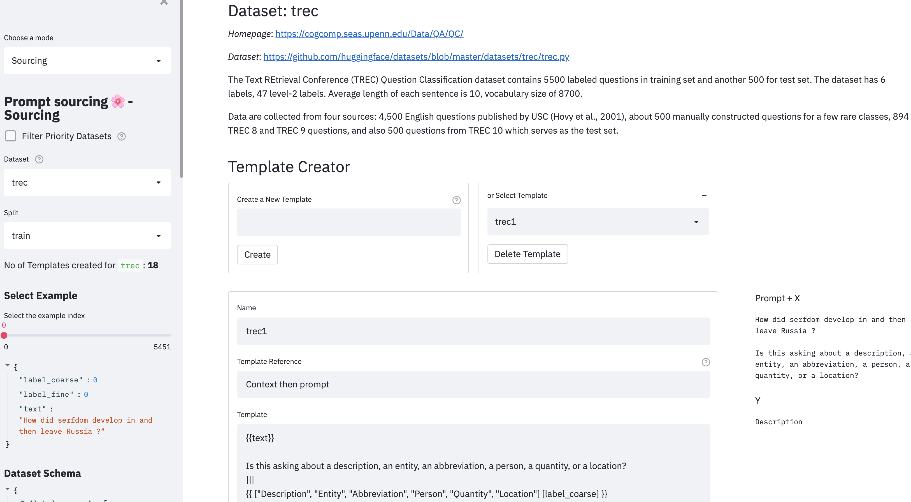

# PromptSource
Promptsource is a toolkit for collecting and applying prompts to NLP datasets.

Promptsource uses a simple templating language to programatically map an example of a dataset into a text input and a text target.

Promptsource contains a growing collection of prompts (which we call **P3**: **P**ublic **P**ool of **P**rompts). As of October 18th, there are ~2'000 prompts for 170+ datasets in P3.
Feel free to use these prompts as they are (you'll find citation details [here](#Citation)).

Note that a subset of the prompts are still *Work in Progress*. You'll find the list of the prompts which will potentially be modified in the near future [here](WIP.md). Modifications will in majority consist of metadata collection, but in some cases, will impact the templates themselves. To facilitate traceability, Promptsource is currently pinned at version `0.1.0`.

Propmtsource and P3 were originally developed as part of the paper [Multitask Prompted Training Enables Zero-Shot Task Generalization](https://arxiv.org/abs/2110.08207). We release T0* (pronounce "T Zero"), a series of model trained on P3. Checkpoints are available [here](https://huggingface.co/bigscience/T0pp). In particular, we recommend using T0++ (pronounce "T Zero Plus Plus") as it leads (on average) to the best performances on a variety of NLP tasks

## Setup
1. Download the repo
2. Navigate to root directory of the repo
3. Install requirements with `pip install -r requirements.txt` in a Python 3.7 environment
4. Run `pip install -e .` to install the `promptsource` module

## Running
You can browse through existing prompts on the [hosted version of Promptsource](https://bigscience.huggingface.co/promptsource).

If you want to launch a local version (in particular to write propmts, from the root directory of the repo, launch the editor with:
```
streamlit run promptsource/app.py
```

There are 3 modes in the app:
- **Helicopter view**: aggregate high level metrics on the current state of the sourcing
- **Prompted dataset viewer**: check the templates you wrote or already written on entire dataset
- **Sourcing**: write new prompts



## Running (read-only)
To host a public streamlit app, launch it with
```bash
streamlit run promptsource/app.py -- -r
```

## Prompting an Example:
You can use Promptsource with [Datasets](https://huggingface.co/docs/datasets/) to create
prompted examples:
```python
# Get an example
from datasets import load_dataset
dataset = load_dataset("ag_news")
example = dataset["train"][0]

# Prompt it
from promptsource.templates import DatasetTemplates
# Get all the AG News prompts
ag_news_prompts = DatasetTemplates('ag_news')
# Select a prompt by name
prompt = ag_news_prompts["classify_question_first"]
# Apply the prompt on the example 
result = prompt.apply(example)
print("INPUT: ", result[0])
print("TARGET: ", result[1])
```

You can collect all the available datasets and their associated prompts

```python
from promptsource.templates import TemplateCollection

# Get all the prompts
collection = TemplateCollection()

# Return a dict where the key is the pair (dataset name, subset name)
# and the value is an instance of DatasetTemplates
print(collection.datasets_templates)
```
## Contributing
Contribution guidelines and step-by-step *HOW TO* are described [here](CONTRIBUTING.md).

## Writing Prompts
A prompt is expressed in [Jinja](https://jinja.palletsprojects.com/en/3.0.x/).

It is rendered using an example from the corresponding Hugging Face datasets library
(a dictionary). The separator ||| should appear once to divide the template into input
and target. Generally, the prompt should provide information on the desired behavior,
e.g., text passage and instructions, and the output should be a desired response.

For more information, read the [Contribution guidelines](CONTRIBUTING.md).

## Known Issues

**Warning or Error about Darwin on OS X:** Try downgrading PyArrow to 3.0.0.

**ConnectionRefusedError: [Errno 61] Connection refused:** Happens occasionally. Try restarting the app.

## Development structure

Promptsource was developed as part of the [BigScience project for open research 🌸](https://bigscience.huggingface.co/), a year-long initiative targeting the study of large models and datasets. The goal of the project is to research language models in a public environment outside large technology companies. The project has 600 researchers from 50 countries and more than 250 institutions.

## Citation

If you want to cite this P3 or Promptsource, you can use this bibtex:
```bibtex
@misc{sanh2021multitask,
      title={Multitask Prompted Training Enables Zero-Shot Task Generalization}, 
      author={Victor Sanh and Albert Webson and Colin Raffel and Stephen H. Bach and Lintang Sutawika and Zaid Alyafeai and Antoine Chaffin and Arnaud Stiegler and Teven Le Scao and Arun Raja and Manan Dey and M Saiful Bari and Canwen Xu and Urmish Thakker and Shanya Sharma Sharma and Eliza Szczechla and Taewoon Kim and Gunjan Chhablani and Nihal Nayak and Debajyoti Datta and Jonathan Chang and Mike Tian-Jian Jiang and Han Wang and Matteo Manica and Sheng Shen and Zheng Xin Yong and Harshit Pandey and Rachel Bawden and Thomas Wang and Trishala Neeraj and Jos Rozen and Abheesht Sharma and Andrea Santilli and Thibault Fevry and Jason Alan Fries and Ryan Teehan and Stella Biderman and Leo Gao and Tali Bers and Thomas Wolf and Alexander M. Rush},
      year={2021},
      eprint={2110.08207},
      archivePrefix={arXiv},
      primaryClass={cs.LG}
}
```
