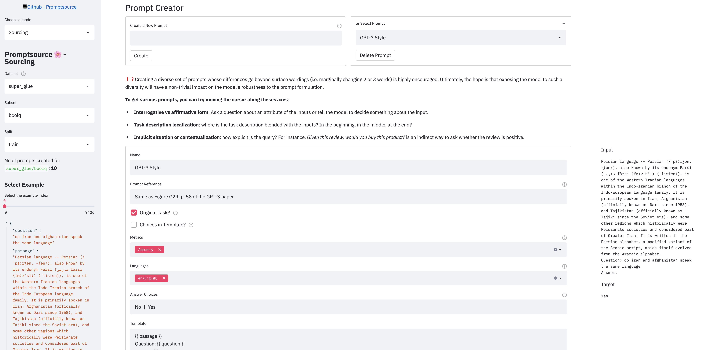

# PromptSource
Toolkit for collecting and applying templates of prompting instances.

WIP

## Setup
1. Download the repo
2. Navigate to root directory of the repo
3. Install requirements with `pip install -r requirements.txt`

## Running
From the root directory of the repo, you can launch the editor with
```
streamlit run promptsource/promptsource.py
```

There are 3 modes in the app:
- **Helicopter view**: aggregate high level metrics on the current state of the sourcing
- **Prompted dataset viewer**: check the templates you wrote or already written on entire dataset
- **Sourcing**: write new prompts



## Running (read-only)
To host a public streamlit app, launch it with
```bash
streamlit run promptsource/promptsource.py -- -r
```

## Contributing
Join the **Hackaprompt** and help writing templates!

Contribution guidelines and step-by-step *HOW TO* are described [here](CONTRIBUTING.md).

## Writing Templates
A prompt template is expressed in [Jinja](https://jinja.palletsprojects.com/en/3.0.x/).

It is rendered using an example from the corresponding Hugging Face datasets library
(a dictionary). The separator ||| should appear once to divide the template into prompt
and output. Generally, the prompt should provide information on the desired behavior,
e.g., text passage and instructions, and the output should be a desired response.

Here's an example for [AG News](https://huggingface.co/datasets/ag_news):
```jinja
{{text}}
Is this a piece of news regarding {{"world politics"}}, {{"sports"}}, {{"business"}}, or {{"science and technology"}}? |||
{{ ["World politics", "Sports", "Business", "Science and technology"][label] }}
```

For more information, read the [Contribution guidelines](CONTRIBUTING.md).

## Other documentation
- Experimental context: [Experiment D](https://docs.google.com/document/d/1ar9cTRs9ZWxMkW-_9jF1ZtfY-u8IK_sO5QOtq1qnC2I/edit?usp=sharing)
- Prompting interface: [design doc](https://docs.google.com/document/d/1IQzrrAAMPS0XAn_ArOq2hyEDCVfeB7AfcvLUqgSnWxQ/)
## Known Issues

**Warning or Error about Darwin on OS X:** Try downgrading PyArrow to 3.0.0.
